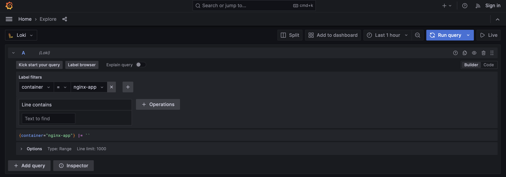
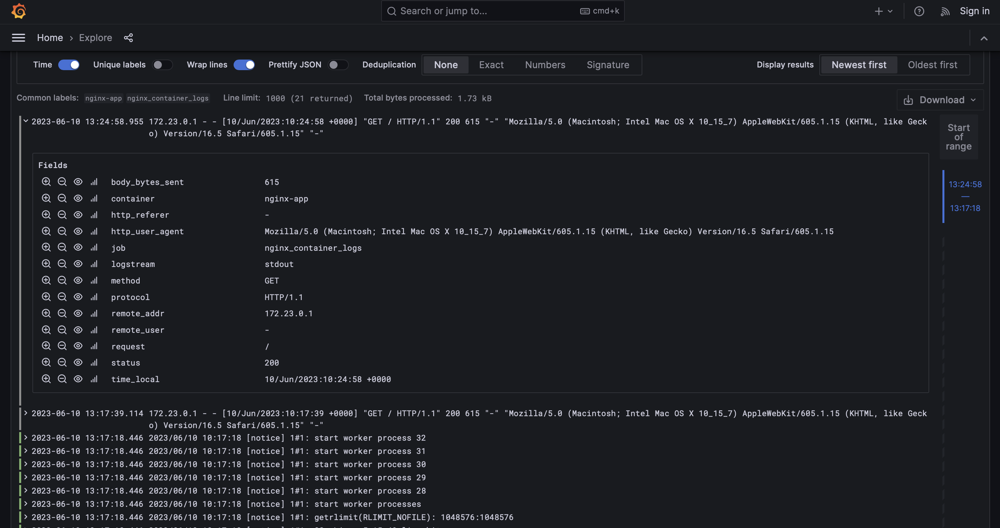

 Grafana + Loki + Promtail + Nginx
====================================

## How to run:

```bash
# run
make init

#stop
make down

# stop with clear volumes
make down-clear
```

## Pages (links)

* [http://localhost:8080][101] nginx.
* [http://localhost:3000][102] Grafana home page.
* [http://localhost:3000/explore][103] Grafana explore page (with Loki).
* [http://localhost:3100/metrics][104] Loki metrics.

## Screenshots `Grafana explore`


---


[//]: # (Pages links)

[101]: http://localhost:8080

[102]: http://localhost:3000

[103]: http://localhost:3000/explore

[104]: http://localhost:3100/metrics
